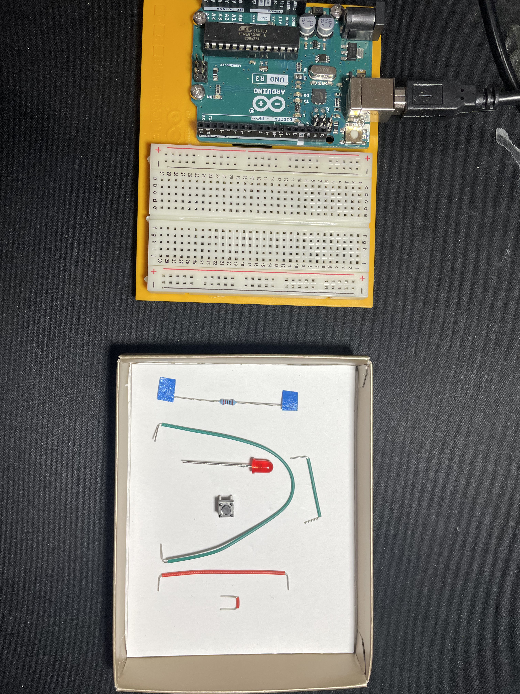
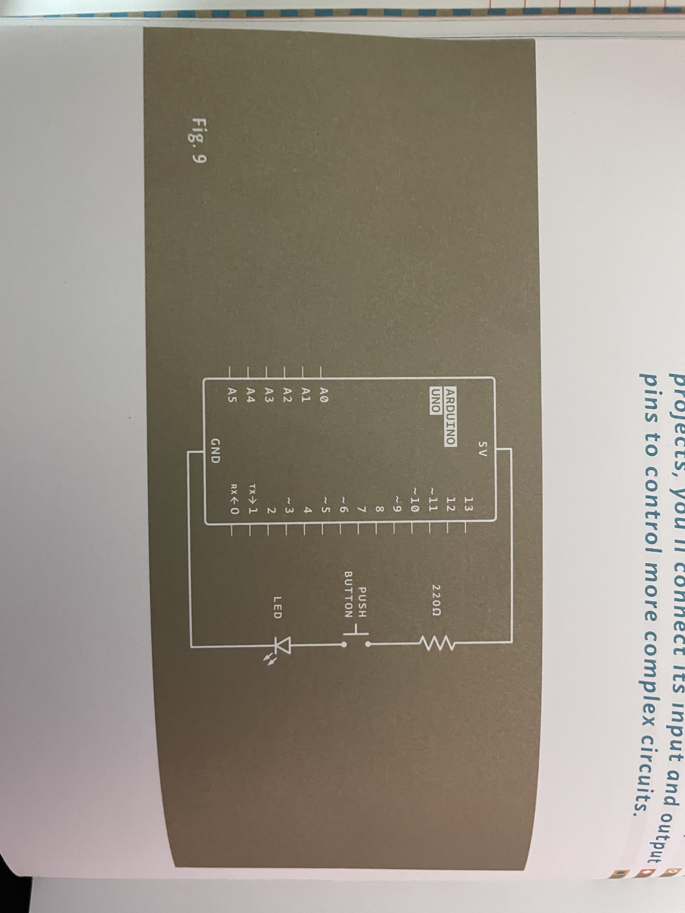
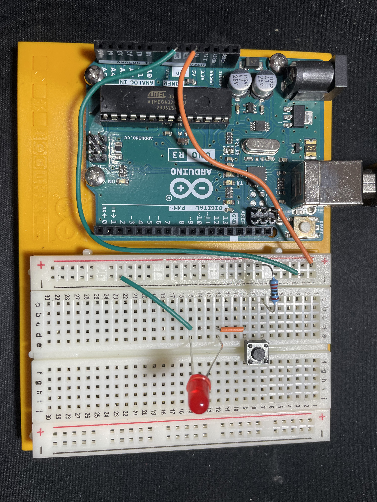

# Project 01: GET TO KNOW YOUR TOOLS

## About
In this chapter, I was introduced to the concept of voltage, currents, and resistors along with electrical components such as transducers, sensors, actuators, and circuts. 

I learned how to read the color codes on the resistors and how the breadboard can be used to create circuits

## First circuit

This was the first circuit I made using a switch, resistor, and LED. following this schematic.

### Demonstration

<video width="320" heigh="240" controls>
    <source src="./media/switch_circuit_demo.MOV" type="video/mp4">
</video>
